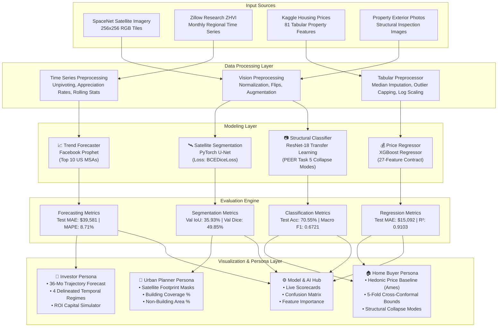

# RealtyAI: System Architecture & Technical Specifications

## Executive Architecture Overview
The **RealtyAI Smart Real Estate Insight Platform** integrates multimodal inputs (satellite imagery, property photos, and tabular housing transactions) through four machine learning and deep learning pipelines. The output is delivered through an interactive, multi-persona Streamlit dashboard.

---

## 1. High-Level System Architecture Diagram

---

## 2. Component Specifications

### 2.1 Satellite Image Segmentation Module (U-Net)
- **Framework**: PyTorch 2.9
- **Architecture**: U-Net with contracting path (DoubleConv + MaxPool2d), bottleneck, expansive path (ConvTranspose2d + skip connections), and 1x1 final convolution.
- **Loss Function**: `BCEDiceLoss` combining Binary Cross-Entropy and Dice loss to penalize false positives and false negatives on building boundaries:
  $$\mathcal{L}_{\text{total}} = 0.5 \cdot \mathcal{L}_{\text{BCE}} + 0.5 \cdot (1 - \text{Dice})$$
- **Input**: 3-channel RGB image tensor $(B, 3, 256, 256)$ from SpaceNet 2 Las Vegas AOI 2.
- **Output**: 1-channel binary segmentation mask $(B, 1, 256, 256)$ where pixels $> 0.5$ indicate building footprints.
- **Validation Evaluation ($N=6$ held-out chips)**: Mean IoU: **35.93%**, Mean Dice: **49.85%**, Mean Precision: **71.42%**, Mean Recall: **43.34%** (official public test labels unavailable locally).
- **Zone Analytics**:
  - Building Footprint Density: $\frac{\sum \text{Building Pixels}}{\text{Total Pixels}} \times 100\%$
  - Non-Building Surface Area: $100\% - \text{Density}$ (pavement, roads, driveways, unpaved bare dirt; multi-spectral vegetation indices required for green space).
  - Zoning Tiers: Low Density ($<10\%$), Suburban ($10-28\%$), High-Density Urban ($>28\%$).

### 2.2 Structural Condition Classifier (ResNet-18)
- **Framework**: PyTorch / TorchVision
- **Architecture**: ResNet-18 backbone with a custom MLP classification head (Linear(512, 128) $\to$ ReLU $\to$ BatchNorm1d $\to$ Dropout(0.2) $\to$ Linear(128, 3)).
- **Dataset**: Authentic PEER Hub ImageNet Task 5 post-earthquake structural reconnaissance imagery ($N=1,372$ total unique images: 1,042 train, 184 validation, 146 benchmark test).
- **Classes**:
  1. `global_collapse`: Severe building structural failure / total loss.
  2. `non_collapse`: Structurally sound / standing envelope.
  3. `partial_collapse`: Localized structural failure / severe damage.
- **Benchmark Test Evaluation ($N=146$)**: Accuracy: **70.55%**, Macro F1: **0.6721**, Weighted F1: **0.6984**.

### 2.3 Hedonic Price Regressor (XGBoost)
- **Framework**: XGBoost 3.1 (selected over LightGBM based on validation RMSE).
- **Dataset**: Ames Housing Dataset (1,458 residential transactions, 2006–2010; 70% train, 15% validation, 15% held-out test).
- **Feature Contract**: Strict 27-feature schema (12 user inputs, 6 derived, 9 training medians).
- **Target Variable**: $\log(1 + \text{SalePrice})$ to mitigate target skewness.
- **Held-Out Test Evaluation ($N=219$)**: MAE: **$15,092.41**, RMSE: **$22,203.78**, $R^2$: **0.9103**, MAPE: **9.17%**.
- **Uncertainty Quantification**: 5-Fold Cross-Conformal Prediction (Vovk 2015; Barber et al. 2021) calibrated on $N=1,020$ out-of-fold training residuals. Relative margin: **$\pm 19.59\%$**, empirical test coverage: **$92.24\%$** (exceeding nominal $90.0\%$ target).

### 2.4 Time-Series Trend Forecaster (Facebook Prophet)
- **Framework**: Prophet 1.4 (CmdStanPy backend) across Top 10 US Metropolitan Statistical Areas.
- **Temporal Evaluation**: Chronological forward-chaining split (Training: 2000–2021 [264 months], Validation: 2022–2023 [24 months], Test: 2024–2026 [32 months]).
- **Held-Out Test Evaluation ($N=10$ MSAs, 320 monthly observations)**:
  - Arithmetic Mean MAE: **$39,580.75**
  - Arithmetic Mean RMSE: **$45,888.30**
  - Arithmetic Mean MAPE: **8.71%**
  - Mean 95% Forecast Interval Empirical Coverage: **40.31%** (reflecting empirical macroeconomic regime shifts).
- **Horizon**: 36 months forward projection with 95% forecast intervals.

---

## 3. Deployment and Execution Model
- **Front-end / App**: Streamlit 1.52 with custom CSS glassmorphism, Plotly Express interactive charts, and Folium geospatial mapping.
- **State Management**: Streamlit cached resources (`@st.cache_resource`, `@st.cache_data`) for instantaneous inference without repeated model reloading.
- **Hardware Portability**: Full CPU multi-threading support without requiring CUDA GPU hardware.
